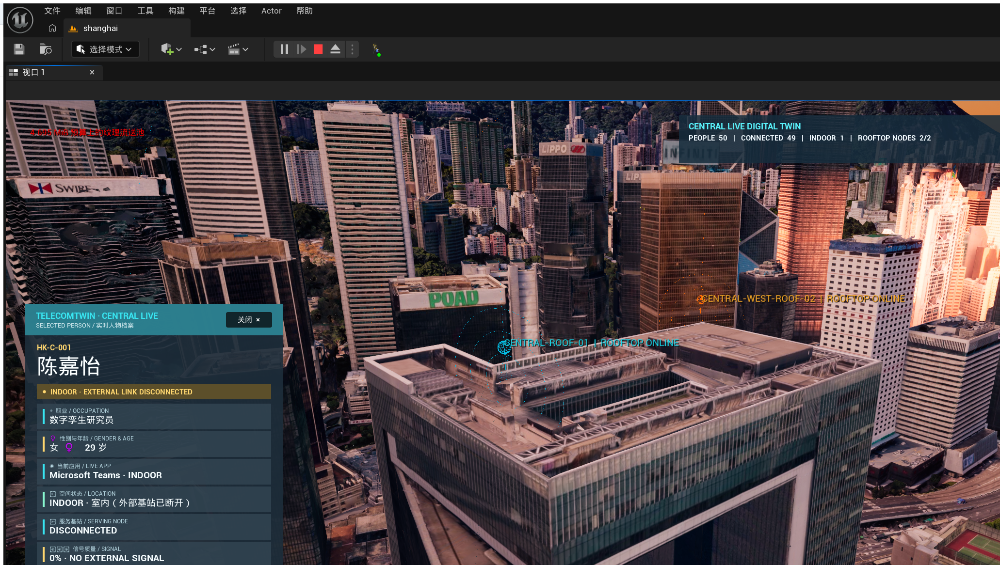

# TelecomTwin 50 人投资演示交付说明

## 交付结论

当前 `feature/investor-delivery-demo` 分支提供一个可重启的中环数字孪生演示闭环：

- 固定运行 50 名行人；50/50 生成、准入、移动和显示。
- 50/50 远景人物继续播放 VAT 步行动画，而不是平移。
- 两座演示基站每 0.5 秒从当前可见 Cesium 碰撞组件重新寻找最高可行走屋面。
- 基站视觉底座只高于实时屋面 4 cm；连续 4 次找不到屋面时会隐藏，拒绝假贴顶。
- 50 人各自维护室外/入楼/室内/出楼、服务基站、信号、应用和切换状态。
- 一名确定性人物循环演示入楼断联、室内应用、出楼和重新驻留。
- 左下半透明人物卡展示姓名、职业、性别年龄、当前应用、位置、服务基站和信号。
- 右上 KPI 展示人数、已连接、室内人数和可用屋顶节点。
- 投资模式运行时隐藏两代旧射线共 3486 个对象，结束 PIE 后恢复原状态。
- 按要求没有录制最终验收视频。



## 启动方法

1. 启动 Unreal MCP Server。
2. 在项目根目录运行：

   ```powershell
   pwsh -ExecutionPolicy Bypass -File .\Scripts\OpenMassCrowd\launch_telecomtwin_citysample.ps1
   ```

3. 等待 `shanghai` 场景完成加载。
4. 在 UE 中按 `Alt+P` 启动 Play。
5. 等待约 30–50 秒，让 Cesium 碰撞、50 人准入和屋顶验证完成。

投资模式、50 人和 12 条稀疏关联线都来自 C++ 默认值与
[`Config/InvestorDeliveryDemo.json`](../Config/InvestorDeliveryDemo.json)，重启后不依赖临时注入。
地图资产仍保留历史 `Gate100` 字段；投资模式运行时明确覆盖为 50，不会改写用户地图。

## 推荐演示顺序

1. 先用城市屋顶镜头介绍“香港中环实时数字孪生”，指出两个屋顶节点和右上 KPI。
2. 展示青色主节点、橙色辅助节点及其动态脉冲，强调节点只在实时 Cesium 屋面验证通过后显示。
3. 切换到人物卡，讲解一个人同时具有身份、应用、位置、服务节点和信号状态。
4. 等待人物进入建筑入口：卡片变为 `INDOOR`、服务节点变为 `DISCONNECTED`、信号变为 0%。
5. 等待人物离开后说明它会立即重新选择覆盖内节点；这构成“人—建筑—网络”的最小业务闭环。

## 运行验收

在 Play 正常运行时执行：

```powershell
python .\Scripts\OpenMassCrowd\verify_investor_delivery_demo_runtime.py --transition-wait 14
```

最新报告：[`investor_delivery_runtime_latest.json`](Evidence/InvestorDelivery/investor_delivery_runtime_latest.json)。

2026-07-30 最终干净重启结果：

| 检查 | 结果 |
|---|---:|
| 50 人生成/准入/移动/显示 | 50 / 50 / 50 / 50 |
| 远景 VAT 步行 | 50 / 50 |
| 不支持地面位置 | 0 |
| 严重重叠 | 0 |
| 实时屋顶节点 | 2 / 2 |
| 节点到实时屋面偏移 | 4 cm / 4 cm |
| 屋顶连续验证失败 | 0 / 0 |
| 室外连接 | 50 / 50 |
| 入楼/出楼/重新驻留事件 | 已全部观测 |
| 旧射线隐藏且可恢复 | 3486 |
| 最终视频 | 未创建 |

## 数据与接口

- `GetInvestorDemoEvidenceSnapshot()`：人口、屋顶、网络、建筑、UI 和旧射线状态。
- `GetCentralProfileEvidenceSnapshot()`：选中人物实时档案。
- `GetCentralVATAnimationEvidenceSnapshot()`：远景 VAT 帧、速度、播放率和距离。
- `ShowCentralProfileByStableIndex(index)`：按稳定索引选择人物。
- [`setup_investor_delivery_demo.py`](../Scripts/OpenMassCrowd/setup_investor_delivery_demo.py)：显式设置入口；正常重启不需要运行。
- [`set_investor_people_camera.py`](../Scripts/OpenMassCrowd/set_investor_people_camera.py)：演示取景辅助，不参与业务启动。

## 设计边界

- 这是投资演示用的确定性业务闭环，不是完整 RF 射线追踪、室内导航或真实用户数据系统。
- “入楼”采用一个贴地入口和状态机表达；没有制作建筑室内模型。
- 信号质量是覆盖半径与二维距离生成的演示指标，带 18 m 切换滞回，不是电磁仿真结果。
- 近地面摄影测量模型在部分位置存在原始破碎几何/低清贴图；演示优先采用城市和屋顶镜头。
- 旧信道资产没有删除，只在投资模式的 PIE 会话中隐藏，结束会话后恢复。

## 回滚与 Git

- 本轮开始前回滚点：`checkpoint/central-100-far-gait-2026-07-30`
- 实施分支：`feature/investor-delivery-demo`
- 项目远程：`https://github.com/zhaowensong/unrealHKU.git`
- 本轮没有修改地图资产；用户已有的地图和旧证据文件保持未暂存状态。
