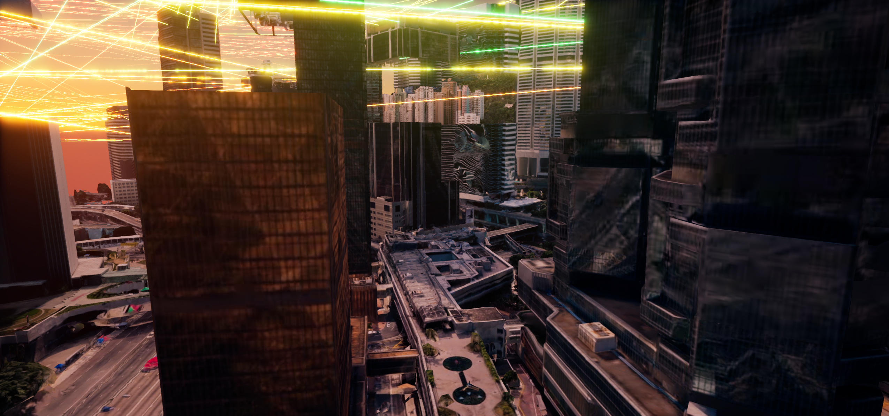

# TelecomTwin 100 人投资演示交付说明

## 交付结论

当前 `feature/investor-delivery-demo` 分支提供一个可重启的中环数字孪生演示闭环：

- 固定运行 100 名行人；100/100 生成、准入、移动和显示。
- 近景使用受限的低成本骨骼角色，远景使用 VAT；100 人都有持续步行动画，而不是平移。
- 两座演示基站每 0.5 秒从当前可见 Cesium 碰撞组件重新寻找最高可行走屋面。
- 基站视觉底座只高于实时屋面 4 cm；连续 4 次找不到屋面时会隐藏，拒绝假贴顶。
- 100 人各自维护室外/入楼/室内/出楼、服务基站、信号、应用和切换状态。
- 一名确定性人物循环演示入楼断联、室内应用、出楼和重新驻留。
- 左下半透明人物卡展示姓名、职业、性别年龄、当前应用、位置、服务基站和信号。
- 右上 KPI 展示人数、已连接、室内人数和可用屋顶节点。
- 人物模式直接复用关卡中 30 个信源与 1920 个四色信道对象的精确世界变换；运行时只合并成 9 个 HISM 绘制批次，不重算落点、不再画悬空 Debug 射线，结束 PIE 后恢复原 Actor 状态。
- 按要求没有录制最终验收视频。



## 启动方法

### 给接收方的一键方式（推荐）

双击项目根目录的 `启动TelecomTwin演示.bat`。脚本会自动启动或复用正确的 UE、进入 Play、等待 100 人、定位镜头并验证稳定性能。命令窗口显示“演示已就绪”后即可讲解；不需要 Codex、外部 MCP Server 或手动按 `Alt+P`。

完整说明：[`TelecomTwin一键演示说明.md`](TelecomTwin一键演示说明.md)。

### 开发者手动方式

1. 启动 Unreal MCP Server。
2. 在项目根目录运行：

   ```powershell
   pwsh -ExecutionPolicy Bypass -File .\Scripts\OpenMassCrowd\launch_telecomtwin_citysample.ps1
   ```

3. 等待 `shanghai` 场景完成加载。
4. 在 UE 中按 `Alt+P` 启动 Play。
5. 等待约 30–50 秒，让 Cesium 碰撞、100 人准入和屋顶验证完成。

投资模式和 100 人都来自 C++ 默认值与
[`Config/InvestorDeliveryDemo.json`](../Config/InvestorDeliveryDemo.json)，重启后不依赖临时注入。
地图中的 Spawner 已保存为 `Gate100` 与 100 人；启动脚本不会再临时修改地图。

## 推荐演示顺序

1. 先用城市屋顶镜头介绍“香港中环实时数字孪生”，展示与无人物版本相同的 Green / Yellow / Orange / Red 四色信道和右上 KPI。
2. 强调人物模式没有第二套临时射线；运行画面直接使用关卡中已经保存的真实屋顶落点。
3. 切换到人物卡，讲解一个人同时具有身份、应用、位置、服务节点和信号状态。
4. 等待人物进入建筑入口：卡片变为 `INDOOR`、服务节点变为 `DISCONNECTED`、信号变为 0%。
5. 等待人物离开后说明它会立即重新选择覆盖内节点；这构成“人—建筑—网络”的最小业务闭环。

## 运行验收

在 Play 正常运行时执行：

```powershell
python .\Scripts\OpenMassCrowd\verify_investor_delivery_demo_runtime.py --transition-wait 14 --expected-population 100 --output .\Docs\Evidence\InvestorDelivery\investor_delivery_100_runtime_latest.json
```

最新报告：[`investor_delivery_100_runtime_latest.json`](Evidence/InvestorDelivery/investor_delivery_100_runtime_latest.json)。

2026-08-01 冷启动后的稳定运行结果：

| 检查 | 结果 |
|---|---:|
| 100 人生成/准入/移动/显示 | 100 / 100 / 100 / 100 |
| 远景步行显示 | 17 个低成本骨骼角色 + 83 个 VAT（本次采样） |
| 不支持地面位置 | 0 |
| 严重重叠 | 0 |
| 60 秒持续运行 | 最少移动 100，最大卡住 0，最大静止 1.018 s |
| 稳定帧时 | P50 20.361 ms，P95 24.126 ms |
| 活跃认证道路 | 31–32 条 |
| 实时屋顶节点 | 2 / 2 |
| 节点到实时屋面偏移 | 4 cm / 4 cm |
| 屋顶连续验证失败 | 0 / 0 |
| 室外连接 | 100 / 100 |
| 入楼/出楼/重新驻留事件 | 已全部观测 |
| 原信道对象 / PIE 批次实例 | 1950 / 1950 |
| PIE 绘制批次 | 9 |
| 编辑器态与 PIE 变换最大误差 | 位置 0 cm、旋转 0°、缩放 0 |
| 人物模式悬空 Debug 信道 | 已删除 |
| 最终视频 | 未创建 |

## 数据与接口

- `GetInvestorDemoEvidenceSnapshot()`：人口、屋顶、网络、建筑、UI 和原始信道批次/变换误差状态。
- `GetCentralProfileEvidenceSnapshot()`：选中人物实时档案。
- `GetCentralVATAnimationEvidenceSnapshot()`：远景 VAT 帧、速度、播放率和距离。
- `ShowCentralProfileByStableIndex(index)`：按稳定索引选择人物。
- [`setup_investor_delivery_demo.py`](../Scripts/OpenMassCrowd/setup_investor_delivery_demo.py)：显式设置入口；正常重启不需要运行。
- [`set_investor_people_camera.py`](../Scripts/OpenMassCrowd/set_investor_people_camera.py)：演示取景辅助，不参与业务启动。

## 设计边界

- 这是投资演示用的确定性业务闭环，不是完整 RF 射线追踪、室内导航或真实用户数据系统。
- “入楼”采用一个贴地入口和状态机表达；没有制作建筑室内模型。
- 信号质量是覆盖半径与二维距离生成的演示指标，带 18 m 切换滞回，不是电磁仿真结果。
- 近地面摄影测量模型在部分位置存在原始破碎几何/低清贴图；演示优先采用城市和屋顶镜头。
- 原信道资产没有删除或改位；PIE 中仅隐藏独立 Actor 的重复绘制，并用其精确组件世界变换生成批次实例，结束会话后恢复。

## 回滚与 Git

- 本轮开始前回滚点：`checkpoint/investor-50-liveness-2026-08-01`
- 人物模式信道对齐回档点：`checkpoint/people-rooftop-signal-alignment-2026-08-10`
- 实施分支：`feature/investor-delivery-demo`
- 项目远程：`https://github.com/zhaowensong/unrealHKU.git`
- 地图中的 OpenMassCrowdSpawner 已持久化为 100 人；其他用户已有地图/旧证据改动未纳入本轮提交。
