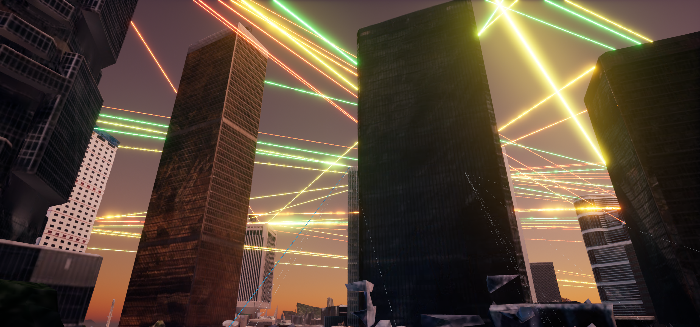

# TelecomTwin 人物—基站关联线恢复

日期：2026-08-11

## 问题现象

人物演示运行后，建筑之间的四色信道已经恢复到真实屋顶落点，旧悬浮层也被隐藏，但原本用于说明人物网络归属的两类线同时消失：

- 当前选中人物到服务基站的蓝色实线；
- 其他已连接人物到服务基站的灰色虚线。

## 根因

此前为了移除运行时的悬浮信道，旧的 `DrawInvestorDemoVisuals()` 被整体删除。它同时包含两类性质不同的内容：

1. 错误的高空假基站、竖杆、圆环、覆盖圈和悬浮信道；
2. 正确且仍需要的人物—基站业务关联线。

因此，删除旧悬浮层时把人物关联层一并删掉了。这不是 Cesium 屋顶碰撞失效，也不是人物没有连接基站。

## 解决方法

新增独立的 `DrawInvestorAssociationVisuals()`，只负责人物关联，不重建任何传播信道：

- 选中人物：深蓝外沿加亮蓝内芯的实线；
- 其他人物：浅灰色虚线；
- 同屏关联线预算：12 条，避免 100 条线同时刷新造成视觉和性能负担；
- 刷新频率：10 Hz；
- 人物端：实时 Mass 人物位置上方 100 cm；
- 基站端：`ValidatedRoofPoint + 4 cm`；
- 屋顶点仍来自实时 Cesium 碰撞校验，不使用固定高空假节点；
- 关联线使用前景深度，仅用于表达“谁连接到哪个基站”，避免被中间建筑完全挡住；四色物理信道仍保持正常世界深度。

旧实现中的高空假基站、竖线、圆环、覆盖圈和假反射均未恢复。

## 验证结果

最终冷启动验收通过：

| 检查项 | 结果 |
|---|---:|
| 配置 / 生成 / 准入人数 | 100 / 100 / 100 |
| 正在移动 | 100 |
| 卡死 | 0 |
| 已连接基站 | 100 |
| 实时屋顶基站 | 2 / 2 |
| 基站端屋顶偏移 | 4 cm |
| 旧悬浮对象已加载 | 2796 |
| 旧悬浮对象仍可见 | 0 |
| 帧时间 P50 / P95 | 22.139 / 29.399 ms |
| 总体验收 | 通过 |

自动验收还确认：`selected_link_style = solid_blue`、`other_link_style = dashed_gray`、`association_visual_enabled = true`。

## 截图

蓝色实线从选中人物指向其服务基站；浅灰虚线表示其他抽样人物的连接关系。画面中的绿色、黄色、橙色、红色线仍是原有真实屋顶信道，两层职责不同。

对应机器可读证据：

- `Docs/Evidence/InvestorDelivery/09_person_station_association_links_2026-08-11.json`
- `Docs/Evidence/InvestorDelivery/investor_delivery_runtime_latest.json`

## 回滚与交付

本次只修改 OpenMassCrowd C++ 模块及验收/截图脚本，不修改关卡资产，也不引入第二版 PowerShell 兼容补丁。接收方仍可在第一版完整项目上直接覆盖新的第三版修正版补丁。
