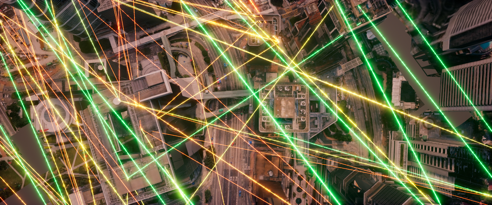

# TelecomTwin：人物—基站连接持续显示

日期：2026-08-12
状态：已实现、已冷启动验证、已通过完整运行时验收

## 问题结论

旧实现不是“随机坏掉”，而是主动只显示少量连接：100 人共享 12 条可视预算，按 9 个阶段轮换。一个未选中人物的灰色虚线大约显示 2 秒、消失 16 秒。另外，旧线段只有 0.12 秒寿命，刷新周期是 0.1 秒；掉帧或编辑器失去焦点时仅有 0.02 秒余量，所以还会闪烁。

这就是“不选中人物时，头顶基站虚线有时有、有时没有”的根因。

## 最终行为

- 当前真正连接到楼顶基站的室外人物全部持续显示连接。
- 未选中人物：低亮度灰色虚线。
- 选中人物：更深的半透明蓝色实线，SRGB 为 `(24, 82, 138, 170)`；比未选中灰色虚线更容易辨认，但不会变成另一层高亮建筑信道。
- 人物进入室内时仍然真实断开，不伪造室内外部基站连接；返回室外后自动恢复。
- 基站端点仍采用 Cesium 实时屋顶碰撞验证点上方 4 cm，不移动基站、不修改建筑信道。
- 启动人物演示不会重建、移动或隐藏已经保存的 30 信源、1,920 条四色建筑信道。

## 实现方式

1. 删除 `association_visual_budget = 12` 和阶段轮换采样。
2. 使用专用 `ULineBatchComponent` 保存完整连接快照，不再依赖短寿命 `DrawDebugLine`。
3. 每 0.1 秒一次性批量替换所有连接线；刷新之间的上一批线保持可见，因此不存在空白帧。
4. 组件自身 Tick 已关闭，避免每帧扫描约 2,200 个线段；生命周期完全由单批刷新控制。
5. 每次运行时证据都会核对：`当前连接人数 = 来源人数 = 实际绘制连接数`。

## 同时关闭的晚加载信道竞态

冷启动回归中发现，World Partition 移动镜头后会继续加载旧悬浮信道 Actor。仅靠每 0.25 秒巡检，旧 Actor 在两个巡检之间有短暂重新可见的可能。

最终采用三层保护：

- Actor 生成时立即隐藏旧悬浮层；
- World Partition 层加载完成时立即复查；
- 4 Hz 周期巡检继续作为兜底。

最终完整验收时已加载 2,922 个旧信道 Actor，可见数为 0；原有 1,950 个持久化屋顶信道 Actor 保持 1,950 个可见，且运行时没有重建覆盖层。

## 验收结果

### 连接持续性

跨越旧版 18 秒轮换周期采样 22 秒、共 12 次：

- 12/12 次 `association_full_coverage = true`；
- 每次都是 100 个真实连接、100 条已绘制连接；
- 其中 99 条灰色虚线、1 条选中蓝色实线；
- `rotating_sampling = false`；
- `persistent_batch_component_tick = false`；
- 100 人移动，卡死人数为 0。

证据：`../Evidence/InvestorDelivery/person_station_association_persistence_2026-08-12.json`

### 完整运行时验收

完整验收器 12/12 项通过：

- 100 人生成、准入、移动和表现全部正常；
- 两个基站均命中真实 Cesium 楼顶；
- 人物进入室内断开、返回室外重连通过；
- 建筑信道启动前后保持同一组持久化 Actor；
- 旧悬浮信道可见数为 0；
- 前台稳定窗口 P50 为 16.667 ms，P95 为 19.317–19.653 ms；
- 地面无效位置 0，严重重叠 0，卡死 0。

证据：`../Evidence/InvestorDelivery/investor_delivery_runtime_persistent_links_2026-08-12.json`

### 画面与流送证据

截图脚本不再把 Mass/VAT 人物误当普通 Actor，而是读取实时 Mass 实体位置取景。拍摄前会同时核对原建筑信道、旧悬浮层和人物连接层。

对应结构化证据：`../Evidence/InvestorDelivery/17_person_station_association_persistent_2026-08-12.json`

### 选中线深蓝调整（2026-08-12）

- 旧选中线：SRGB `(55, 125, 165, 135)`；
- 新选中线：SRGB `(24, 82, 138, 170)`；
- 线宽仍为 `2.25`，保持实线；
- 未选中线仍为 SRGB `(95, 102, 110, 80)` 的灰色虚线，没有修改；
- 运行时报告新增 `network.selected_link_srgb`，完整验收器会强制检查深蓝值，防止后续回归。

调整后完整运行时验收仍为 12/12 项通过：100 人全部移动、卡死 0、悬空 0、严重重叠 0，P95 为 16.846 ms。证据：`../Evidence/InvestorDelivery/investor_delivery_runtime_deep_selected_link_2026-08-12.json`。

## 编译产物

- DLL：`Plugins/OpenMassCrowd/Binaries/Win64/UnrealEditor-OpenMassCrowd.dll`
- 大小：1,111,040 bytes
- 编译时间：2026-08-12 08:38:12 +08:00
- SHA-256：`EB83D53B9C77E9E3ED716EDF235D0FB8F692A1021A5FF47AAC29B575C840EBEC`

## 回归边界

“始终连接”不等于伪造连接。只有处于室外且通过当前服务基站判定的人物持续显示；室内人物按项目既定语义断开。建筑信道和人物—基站关联线是两个独立渲染层：前者在编辑器态与 PIE 中保持同一批 Actor，后者只在人物演示运行时显示。
