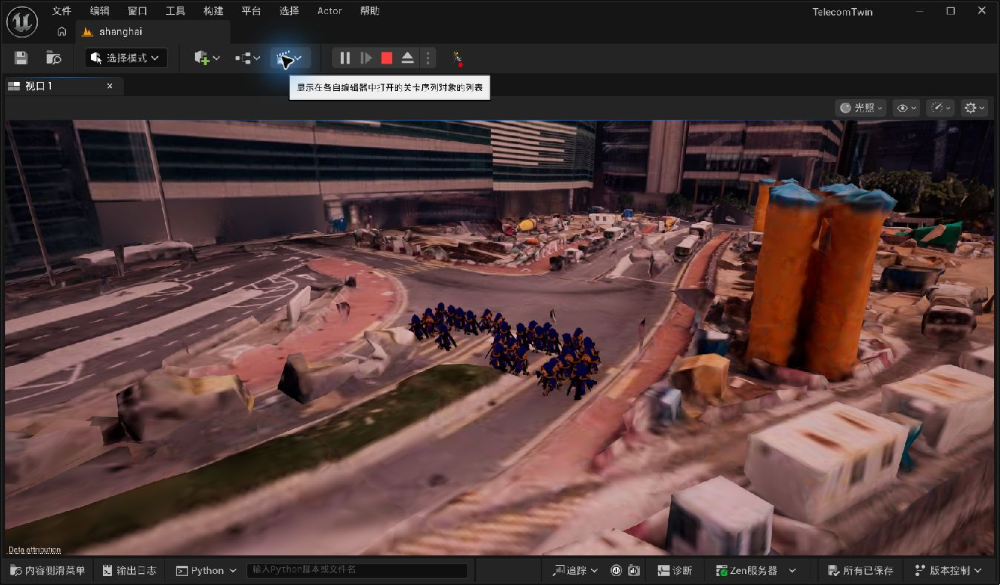
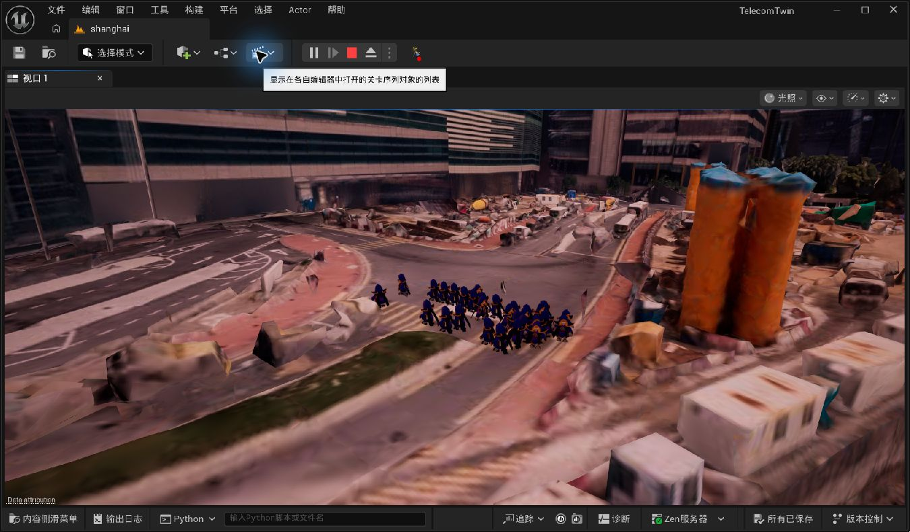
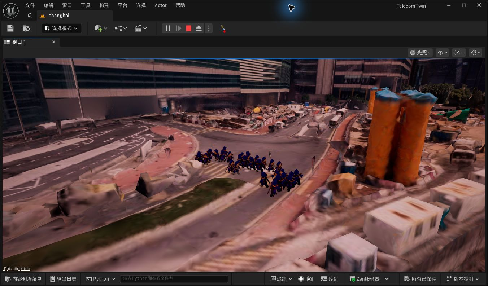

# TelecomTwin 香港 Mass 人群 Demo（UE 5.7）

## 当前结果

项目已在原来的 `/Game/Maps/shanghai` 香港场景中加入一个可回滚、可重启的
30 人步行 Demo。运行平台是 UE 5.7 自带的 MassEntity、MassAI、MassCrowd、
ZoneGraph 和 StateTree，不再依赖已经停止维护的 Miarmy UE 插件。

这次改动没有重建数字孪生场景，也没有修改已有通信射线。Git 变更仅用新的
`HK_OpenMass_Crowd_Spawner` 替换旧的普通 Character 人群生成器和 NavMesh
边界；信号射线脚本、射线资产和现有运行输出均未改动。

## 运行证据

首次稳定运行，30 个 Mass 实体已经显示在 Cesium 香港路面：



继续运行 6 秒后，队形和位置发生变化，证明不是静态摆放：



关闭并重新打开 Unreal Editor 后，没有重新执行布置脚本，直接运行仍能自动
恢复 30 人：



两次成功 PIE 的关键日志一致：

```text
OPEN_MASS_CROWD_READY requested=30 spawned=30 lanes=2
cesium_route_points=12 center=(-97000.00,222400.00,394.83)
```

最终一次干净重启的日志时间为 2026-07-15 01:28（香港时间）。该次运行没有
`OPEN_MASS_CROWD_ABORT`、断言、Fatal Error 或 Unhandled Exception。

## 四个关键问题如何解决

### 1. 人必须在真实香港场景里走

布置脚本在编辑器中逐个查询已加载的 `CesiumGltfPrimitiveComponent`，先验证
12 个路线采样点，再允许保存生成器。运行时仍会做同样的 Cesium 类型、坡度
和高度检查；不接受普通碰撞平面，也没有用悬空代理面伪装地面。

生成器现在拥有真正的 `USceneComponent` 根组件，因此保存的香港坐标会在 PIE
和编辑器重启后保持为 `(-97000, 222400, 394.83)`，不会退回世界原点。

### 2. 人群必须持续移动，不是手工摆放

运行时创建两条方向相反的闭合 ZoneGraph 路线，并生成 30 个真正的 Mass
Entity。每个 Entity 都通过 `FMassZoneGraphLaneLocationFragment`、短路径请求
和 Mass 移动处理器沿路线循环，不由 Actor Tick 直接改坐标假装导航。

### 3. 人群要具备转向和局部避让

实体配置包含以下 UE 5.7 原生 Trait：

- `UMassMovementTrait`
- `UMassSteeringTrait`
- `UMassSmoothOrientationTrait`
- `UMassNavigationObstacleTrait`
- `UMassObstacleAvoidanceTrait`
- `UMassZoneGraphNavigationTrait`
- `UMassCrowdMemberTrait`

`NavigationObstacle` 把每个人注册为局部避障邻居，`ObstacleAvoidance` 计算避让，
`SmoothOrientation` 让人物跟随运动方向转向。两组人使用相反方向的路线，可以
在同一片街道上产生会车和局部避让。

### 4. 工程必须稳定、可调、可重启

- 人数由 `PopulationCount` 控制，关卡当前保存为 30，编辑器可调范围 1–500。
- Cesium 瓦片尚未加载时使用定时重试，禁止同步递归，避免栈溢出。
- Mass 创建观察器完成后才写入运行时 lane handle，防止默认初始化器清空路线。
- 每次路径请求显式使用实体当前位置作为 `StartPosition`，不会从世界原点生成
  假路径。
- 地面高度每 0.2 秒重新检查一次 Cesium 碰撞，人物脚底保持在真实路面。
- `EndPlay` 先销毁 Mass Entity，再销毁视觉 Actor 和运行时 ZoneGraph，避免关卡
  停止或重启时留下无效引用。

## 怎么启动

1. 用 UE 5.7 打开项目根目录的 `TelecomTwin.uproject`。
2. 等待 `shanghai` 场景和附近 Cesium 瓦片显示。
3. 点击工具栏“运行”，或按 `Alt+P`。
4. 在日志中确认 `OPEN_MASS_CROWD_READY requested=30 spawned=30`。

关卡已经保存好，不需要每次运行 Python。只有在生成器被手动删除或需要重新
选择街区时，才执行：

```python
exec(open(r"<项目目录>/Scripts/OpenMassCrowd/setup_open_mass_crowd_demo.py", encoding="utf-8").read())
```

该脚本只删除既有的人群 Demo 标签，不会删除或重建通信射线。

## 主要文件

- `Plugins/OpenMassCrowd/`：隔离的 UE 5.7 Mass/ZoneGraph 运行时插件。
- `Scripts/OpenMassCrowd/setup_open_mass_crowd_demo.py`：Cesium 路面验证和一次性
  关卡布置脚本。
- `Config/DefaultPlugins.ini`：MassCrowd 使用的 lane tag 配置。
- `Content/Maps/shanghai.umap` 与对应 External Actor：保存人群生成器实例。
- `Docs/Evidence/OpenMassCrowd/`：本次验证截图。

## 已知限制

- 当前人物外观复用工程已有的 BattleWizard 骨骼网格，所以 30 人外观相同；
  这验证的是群集运动架构，不是最终城市人口美术。
- 30 人 Demo 使用轻量视觉 Actor 同步 Mass Transform。若扩展到数百或数千人，
  应替换为 MassRepresentation + VAT/实例化人物 LOD；这不影响当前行为层。
- 路线是本地 12 点闭合路线，不是全香港自动人行路网。
- 启动时仍可能出现工程原有的 Cesium metadata 检查警告和 Water collision profile
  提示；它们与本次人群运行无关，成功运行日志已验证不会阻止 Demo。

## 许可与回滚

运行时使用 Unreal Engine 自带模块，遵循 Epic Games 的 Unreal Engine 许可。
方案调研参考了 MIT 许可的 `Ji-Rath/MassAIExample`，本插件没有复制该仓库源文件；
详见 `Plugins/OpenMassCrowd/THIRD_PARTY_NOTICES.md`。

集成前的远程回滚点是：

```text
rollback/hk-street-crowd-30-2026-07-14
8a4a24e879414c10dae72f6d145ca31bf548f034
```

Mass 版本位于分支 `experiment/open-mass-crowd-ue57`。因此可以在新版本和旧的
30 人 Character 版本之间明确切换，不需要手工拆插件或猜测哪些文件被改过。
