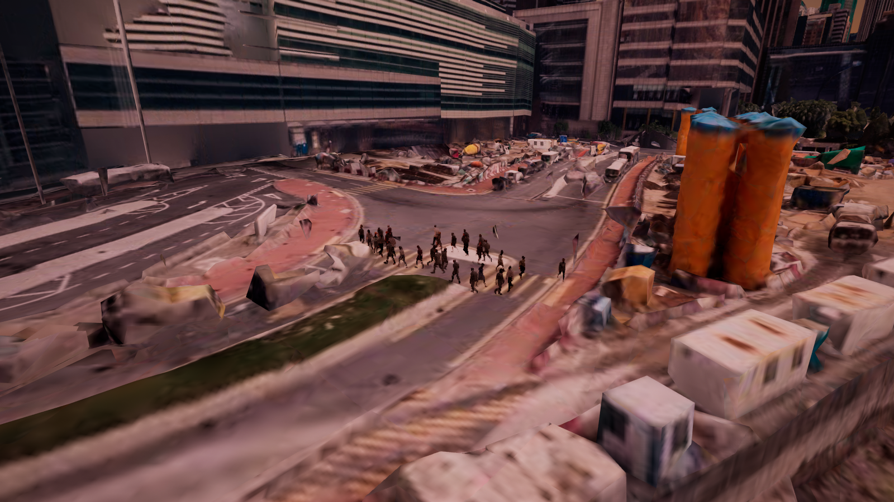
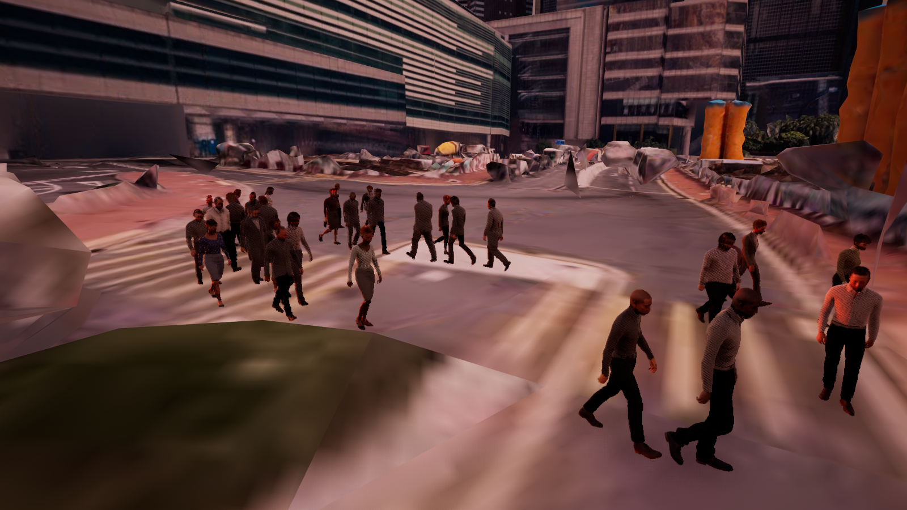
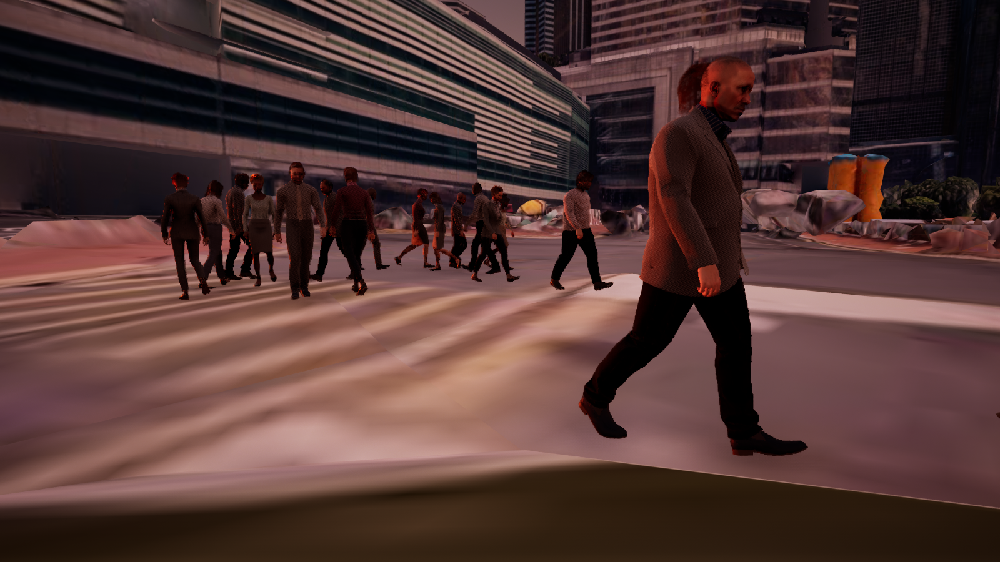
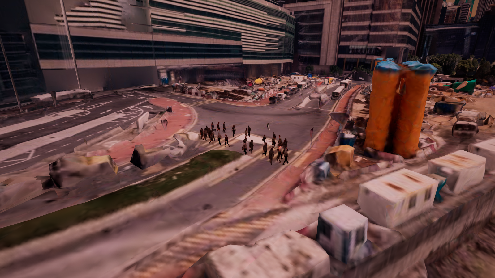

# TelecomTwin 香港 30 人群集 Demo（UE 5.7）

## 当前结果

项目现在使用 UE 5.7 的 MassEntity、MassMovement、MassCrowd、ZoneGraph 和
StateTree 作为人群模拟层，使用 Epic 官方 City Sample Crowds 作为可视人物层。
Miarmy UE 已停止开发，工程不再依赖它。

最终结果不是在场景里手工摆放 30 个 Character：30 个 Mass Entity 独立移动，
每个 Entity 一对一驱动一个可见人物，人物位置持续投影到真实
`CesiumGltfPrimitiveComponent` 路面。

## 最终重启验证

2026-07-18 关闭并重新启动 Unreal Editor 后，没有执行布置脚本，直接进入 PIE。
自动验证器的 `overall_passed` 为 `true`，错误数为 0。

| 检查项 | 结果 |
|---|---:|
| 唯一人群生成器 | 1 |
| 请求 / Mass Entity / 可见人物 | 30 / 30 / 30 |
| 播放走路动画 | 30 / 30 |
| 可见外观 | 30 种 |
| 6.022 秒移动超过 60 cm | 30 / 30 |
| 移动距离中位数 | 627.887 cm |
| Cesium 路面命中 | 30 / 30 |
| Mass 根节点最大贴地误差 | 2.135 cm |
| 可见脚部贴地检查 | 30 / 30 |
| 信源 | 30 |
| 射线几何 | 1920 |
| 有 Mesh 且可见的射线几何 | 1920 / 1920 |
| 绿 / 黄 / 橙 / 红 | 480 / 480 / 480 / 480 |

完整机器可读结果见
[open_mass_city_sample_runtime_latest.json](Evidence/OpenMassCrowd/open_mass_city_sample_runtime_latest.json)。

## 截图证据

30 个 City Sample 人物在香港街道上运行：



近景截图所在运行批次可见 29 种不同性别、身体、头发和服装组合；最终严格复验
批次为 30 种：



低机位检查脚部与 Cesium 道路接触：



重启后的同一批人物继续运行，位置与前图不同：



## 怎么启动

第一次在一台新电脑上使用，需要先通过自己的 Epic/Fab 权限取得 City Sample
Crowds，然后把官方目录挂到工程的忽略路径：

```powershell
pwsh -ExecutionPolicy Bypass -File .\Scripts\OpenMassCrowd\link_city_sample_crowds.ps1 `
  -Source "D:\CitySampleCrowds_Staging\Content\CitySampleCrowd"
```

随后使用低内存启动器：

```powershell
pwsh -ExecutionPolicy Bypass -File .\Scripts\OpenMassCrowd\launch_telecomtwin_citysample.ps1
```

等待香港 Cesium 瓦片显示后点击工具栏“运行”或按 `Alt+P`。关卡已经保存好，正常
启动不需要 MCP，也不需要运行 Python。MCP 只用于自动化检查、截图或重建布置。

## 关键实现

- `AOpenMassCrowdSpawner` 创建有界 ZoneGraph、30 个 Mass Entity，并配置移动、
  转向、局部障碍和避让 Trait。
- `AOpenMassCrowdCitySampleActor` 只负责显示。它在官方 Blueprint 构造前调用
  `SetRandomOptions`，随机人物组合，并播放官方 MTN 走路动画。
- 每帧在 Mass 更新之后把 `FTransformFragment` 同步到可视 Actor；不存在第二套
  Character 导航或 Tick 移动逻辑。
- 贴地只接受真实 Cesium 碰撞组件。18 cm 脚掌范围的备用采样只用于跨越瓦片
  小缝隙，使用相邻采样的高度时仍保持实体原始 XY。
- 可视人物碰撞全部关闭，避免影响 Cesium 探测和通信射线。
- 布置脚本按类和标签删除旧生成器，并保存唯一实例；旧 BattleWizard External
  Actor 已从关卡删除，因此重启后不会再次出现 60 人重复生成。

## 文件与许可

- `Plugins/OpenMassCrowd/`：隔离的人群运行时代码。
- `Scripts/OpenMassCrowd/`：资源审计、挂载、启动、运行验证和截图脚本。
- `Docs/Evidence/OpenMassCrowd/`：最终 JSON 与截图。
- `Docs/Obsidian/TelecomTwin_CitySample_30_Pedestrian_Demo.md`：完整实施记录。

City Sample Crowds 是 UE-Only Content，完整 6.058 GiB 官方素材通过本地目录联接
加载并被 `.gitignore` 排除。Git 只保存本项目代码、关卡引用、脚本、文档和证据。

## 已知限制

- Demo 只覆盖香港场景中的一段局部道路，不是全城人行路网。
- 当前 30 人使用 Actor 可视表示；没有实现适合数百/数千人的 VAT/ISM 远景 LOD。
- 已启用避让，但本轮没有输出最小人际距离的定量统计。
- 首次构建 City Sample 纹理仍然较重，必须预留 D 盘缓存空间；启动器通过单并发
  编译降低峰值，不代表低配置机器一定实时流畅。

## 回滚点

```text
checkpoint/citysample-pre-assets-2026-07-15
0ad264252223654da99ac5400548d2524df3f4f7
```
